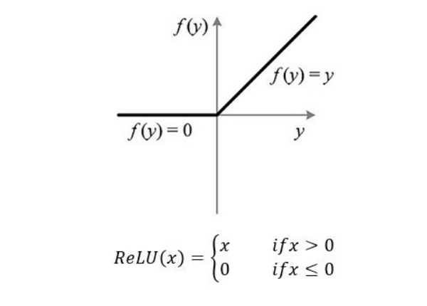

# Readme

  Date:2021-07-31
	    Made By: 纸 石头 紫阳花

_________________________________________________________________________________________________________________


[TOC]

## 题目要求

**The data files train.csv and test.csv contain gray-scale images of hand-drawn digits, from zero through nine.**

**Each image is 28 pixels in height and 28 pixels in width, for a total of 784 pixels in total. Each pixel has a single pixel-value associated with it, indicating the lightness or darkness of that pixel, with higher numbers meaning darker. This pixel-value is an integer between 0 and 255, inclusive.**

**The training data set, (train.csv), has 785 columns. The first column, called "label", is the digit that was drawn by the user. The rest of the columns contain the pixel-values of the associated image.**

**Each pixel column in the training set has a name like pixelx, where x is an integer between 0 and 783, inclusive. To locate this pixel on the image, suppose that we have decomposed x as x = i * 28 + j, where i and j are integers between 0 and 27, inclusive. Then pixelx is located on row i and column j of a 28 x 28 matrix, (indexing by zero).**

**For example, pixel31 indicates the pixel that is in the fourth column from the left, and the second row from the top, as in the ascii-diagram below.**

**Visually, if we omit the "pixel" prefix, the pixels make up the image like this:**

```
000 001 002 003 ... 026 027
028 029 030 031 ... 054 055
056 057 058 059 ... 082 083
 |   |   |   |  ...  |   |
728 729 730 731 ... 754 755
756 757 758 759 ... 782 783 
```

**The test data set, (test.csv), is the same as the training set, except that it does not contain the "label" column.**

**Your submission file should be in the following format: For each of the 28000 images in the test set, output a single line containing the ImageId and the digit you predict. For example, if you predict that the first image is of a 3, the second image is of a 7, and the third image is of a 8, then your submission file would look like:**

```
ImageId,Label1,32,73,8 
(27997 more lines)
```

**The evaluation metric for this contest is the categorization accuracy, or the proportion of test images that are correctly classified. For example, a categorization accuracy of 0.97 indicates that you have correctly classified all but 3% of the images.**

## 解读题目给出的信息

1. train_csv文件是MNIST给出的训练集，除第一列为标签也就是0~9的数字以外，其他列是0到783一共784个像素块在28x28图像中的像素情况。故一行代表的就是一个手写数字识别的像素情况。
2. test_csv是用于预测的测试集，训练集切分为验证集和训练集后，利用k折训练法对模型进行训练，模型训练完成后，预测测试集所代表的标签。
3. 由于要预测多个标签，故为多分类问题，要运用Softmax分类器，由于是图像问题，故应当运用卷积神经网络。


## 构建模型

### Softmax + 全连接层


### CNN神经网络

#### 卷积层

两层卷积：

1. 卷积核个数为6， 卷积核大小为3x3，不做填充， 下采样区域为2x2
2. 卷积核个数为16， 卷积核大小为3x3，不做填充， 下采样区域为2x2

#### 激活函数：Relu

解决Sigmoid函数的易饱和、均值非零问题

Relu 全称 ==Rectified Linear unit== 即修正线性单元



Relu函数的单侧抑制特性是的神经网络中神经元具有稀疏激活性，在深度神经网络中，理论上当模型增加N层之后，Relu神经元的激活都将降低2的n次方倍。

##### 使用Relu函数作为激活函数的意义

使用Relu函数可以有效的稀疏神经元的激活性，Relu对于线性函数来说表达性更强，对于非线性函数，Relu由于非负区梯度为常数，因而不存在梯度消失问题，是模型的收敛速度稳定在一个状态。

#### 池化层

选用最大池化方法，便于提取更能表达图像纹理的特征

#### BatchNorm函数:

BatchNorm是神经网络中常用的加速神经网络训练、加速收敛速度与稳定性的算法。

##### BatchNorm原理

为什么神经网络需要BatchNorm 神经网络的基本目的就是为了学习训练集数据的分布并在测试集上形成很好的泛化能力，而加入batch之间的分布差异性很大，就会对神经网络分布学习的收束造成影响。

并且，数据在经过多层网络的计算后数据分布也会发生变化，即称为 ==Internal Convariate Shift== 的现象。[^1]

Internal Convariate Shift 描述的是训练深度神经网络是经常法神训练困难的问题，因为，每一次参数迭代更新后，上一层网络的输出数据经过这一层网络计算后，其数据的分布会法神改变，为下一层网络的学习带来困难。即，在学习数据分布的过程中，数据分布持续性发生变化。

==Convariate Shift== 和Internal Convariate Shift 具有相似性，Internal Convariate Shift发生在神经网络的内部，Convariate Shift发生在输入数据上。

Convariate Shift 表示测试数据和训练数据的分布具有差异性，对网络的泛化能力和训练速度造成了影响。可以通过==归一化==（对数据去相关性，突出分布相对差异）或者白化来进行弥补。

为了减少Internal Convariaye Shift 进行BatchNorm操作

##### BatchNorm步骤

输入数据是一个批次的数据$\beta = x_1...x_m$ 输出数据是$y_i = BN(x)$ 

1. 先求出此次批量数据的均值与方差
2. 对x做归一化
3. 引入缩放和平移变量，计算归一化后的值$y_i = \gamma \overline{x} + \beta$

如果不引入缩放变量$\gamma$ 和平移变量$\beta$​​ 那么由于对每一层数据进行归一化会摧毁原输入数据的分布特征，会导致神经网络的学习无效。

加入缩放变量$\gamma$​ 和平移变量$\beta$​ 分别等于batch的标准差和均值，那么输出相当于还原到了归一化之前的输出（$归一化操作： \sum_{i = 1}^{m}{\frac{x_i - \mu}{\sigma}}$​）

通过缩放变量和平移变量来在归一化后反向进行一次归一化，从而保留每一次数据数据的分布特征，同时通过归一化加速训练。

##### BatchNorm总结

在有了BatchNorm后可以积极的使用大学习率，从而提高学习速率，本质上BatcNorm是一种正则方式，降低了数据之间的绝对差异，去除相关性，更加关注于相对差异性，可以更好的作用于分类任务。


[^1]:Internal Convariate Shift 可参考论文 [==Batch Normalization: Accelerating Deep Network Training by Reducing Internal Covariate Shift==](https://arxiv.org/abs/1502.03167)

